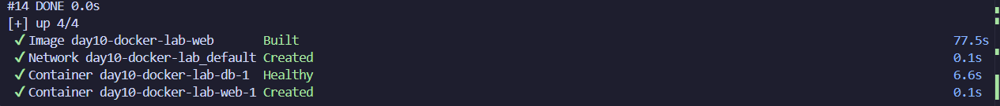

# Docker Lab - Notes API

A full-stack Next.js application with Docker support for containerized development and deployment. This project includes a REST API for managing notes with Prisma as the ORM and PostgreSQL as the database.

## Project Overview

This is a [Next.js](https://nextjs.org) application featuring:
- **API Routes** - RESTful endpoints for managing notes
- **Prisma ORM** - Database access and migrations
- **Docker Support** - Containerized development and production environments
- **TypeScript** - Type-safe codebase
- **Health Check** - Built-in health monitoring endpoint

## Getting Started

### Local Development

1. Install dependencies:
```bash
npm install
```

2. Set up your environment variables by creating a `.env.local` file

3. Run database migrations:
```bash
npx prisma migrate dev
```

4. Start the development server:
```bash
npm run dev
```

Open [http://localhost:3000](http://localhost:3000) to view the application.

### Docker Development

Build and run the application in Docker:

```bash
docker-compose up --build
```

Database values are loaded from files in `secrets/`:
- `secrets/db-url.txt`
- `secrets/db-username.txt`
- `secrets/db-password.txt`
- `secrets/db-name.txt`

These files are ignored by git.

The application will be available at [http://localhost:3000](http://localhost:3000).

## API Endpoints

- `GET /api/health` - Health check endpoint
- `GET /api/notes` - Retrieve all notes
- `POST /api/notes` - Create a new note
- `GET /api/notes/[id]` - Retrieve a specific note
- `PUT /api/notes/[id]` - Update a note
- `DELETE /api/notes/[id]` - Delete a note

## Database

This project uses [Prisma](https://www.prisma.io/) as the ORM with PostgreSQL.

### Running Migrations

```bash
npx prisma migrate dev
```

### Viewing Database

```bash
npx prisma studio
```

## Building for Production

```bash
npm run build
npm start
```

Or use Docker:

```bash
docker build -t notes-api .
docker run -p 3000:3000 notes-api
```

## Learn More

- [Next.js Documentation](https://nextjs.org/docs)
- [Prisma Documentation](https://www.prisma.io/docs)
- [Docker Documentation](https://docs.docker.com)
